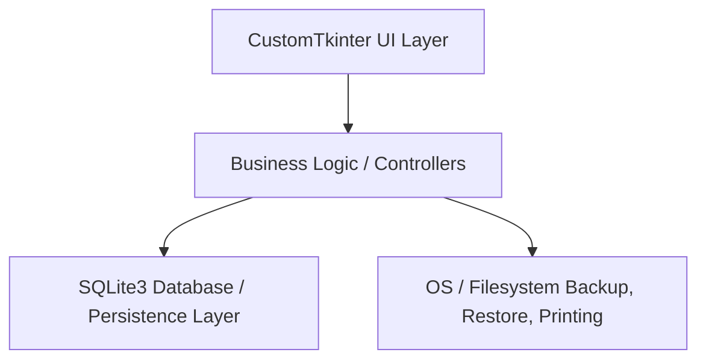
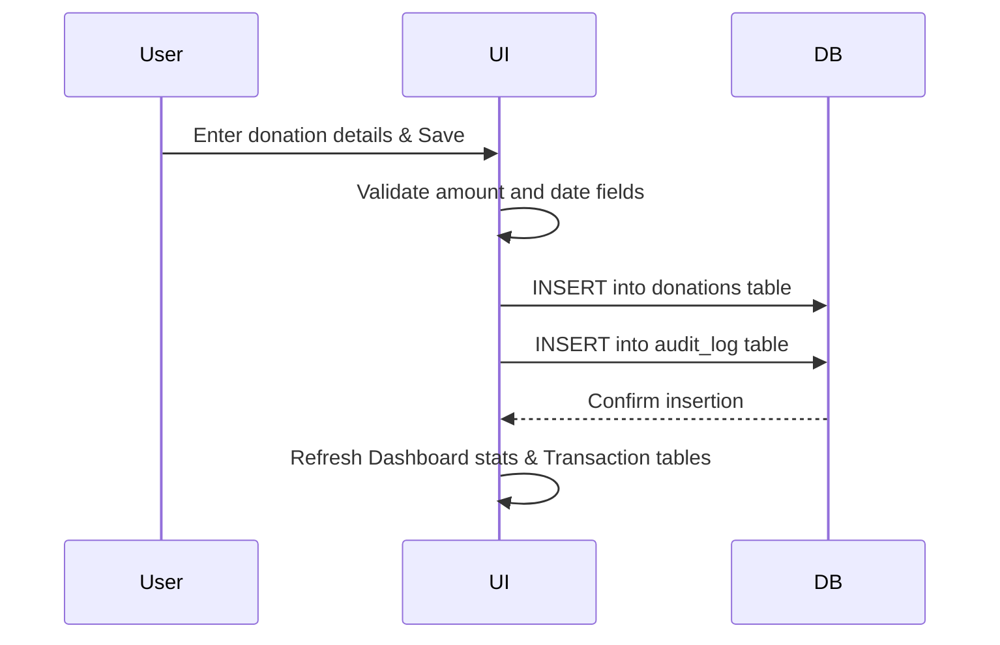
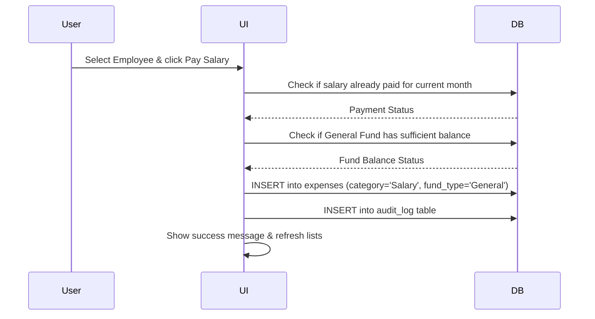

# Code Documentation - Mosque Management System

This document provides a technical walkthrough of the Mosque Management System codebase, detailing the architecture, database schema, file structure, key functions, and data flow.

---

## 1. File & Folder Structure

```text
mosque-management/
├── backups/                      # Directory containing database backup files (.db)
├── build/                        # Build artifact directory generated by PyInstaller
├── dist/                         # Distribution directory containing compiled executables
├── installer-output/             # Folder containing output installers generated by Inno Setup
├── reports/                      # Directory where printed financial reports are saved
├── Screenshots/                  # Screenshots for README documentation
├── .gitignore                    # Git file exclusion rules
├── CODE_DOCUMENTATION.md         # (This file) Developer and architecture documentation
├── CONTRIBUTING.md               # Guidelines for contributing to the repository
├── DESIGN_PHILOSOPHY.md          # Underlying engineering and UX philosophy document
├── inno-setup.iss                # Inno Setup script for compiling the Windows installer
├── LICENSE                       # GPL v3 License text with standard header
├── mosque.db                     # SQLite3 database (ignored by git, created locally)
├── mosque_app.py                 # Main entry point containing application logic and UI
├── MosqueManagementSystem.spec   # PyInstaller build specification script
└── README.md                     # Main project overview and setup guide
```

---

## 2. High-Level Architecture

The Mosque Management System is designed as a **monolithic, offline-first desktop application** following a Layered Architecture:



- **UI Layer**: Built entirely using `CustomTkinter` for a modern, responsive, and dark-themed UI.
- **Business Logic Layer**: Validates input data, formats transactions, calculates fund balances, processes payroll, and checks security locks.
- **Persistence Layer**: Reads and writes data to a local `sqlite3` database.

---

## 3. Database Schema

The database `mosque.db` contains the following tables:

### `donations`
Tracks all incoming donations.
- `id` (INTEGER, Primary Key AUTOINCREMENT)
- `donor_name` (TEXT, optional)
- `amount` (REAL, NOT NULL)
- `category` (TEXT) - e.g., General, Zakat, Sadqa, Construction
- `payment_type` (TEXT) - e.g., Cash, Bank, Online
- `date` (TEXT) - Format: YYYY-MM-DD
- `is_deleted` (INTEGER, Default 0) - Soft-delete flag
- `created_at` (TEXT) - Description timestamp
- `updated_at` (TEXT) - Description timestamp

### `expenses`
Tracks all outgoing expenses.
- `id` (INTEGER, Primary Key AUTOINCREMENT)
- `title` (TEXT, NOT NULL)
- `amount` (REAL, NOT NULL)
- `category` (TEXT) - e.g., Electricity, Gas, Water, Maintenance, Salary, Other
- `paid_to` (TEXT, optional)
- `date` (TEXT) - Format: YYYY-MM-DD
- `notes` (TEXT, optional)
- `fund_type` (TEXT, Default 'General') - Fund source
- `is_deleted` (INTEGER, Default 0)
- `created_at` (TEXT)
- `updated_at` (TEXT)
- `employee_id` (INTEGER, optional) - Link to payroll employee

### `settings`
Stores configuration parameters. Single-row table (`id = 1`).
- `id` (INTEGER, Primary Key)
- `mosque_name` (TEXT)
- `address` (TEXT)
- `phone` (TEXT)
- `imam_name` (TEXT)
- `notes` (TEXT)
- `theme` (TEXT, Default 'dark')
- `password` (TEXT, Default 'admin')
- `backup_path` (TEXT)

### `employees`
Stores personnel details.
- `id` (INTEGER, Primary Key AUTOINCREMENT)
- `name` (TEXT, NOT NULL)
- `role` (TEXT, NOT NULL) - e.g., Imam, Moazzin, Cleaner, Other
- `salary` (REAL, NOT NULL)

### `audit_log`
Tracks administrative and system actions.
- `id` (INTEGER, Primary Key AUTOINCREMENT)
- `action_type` (TEXT) - e.g., INSERT, UPDATE, DELETE
- `table_name` (TEXT)
- `record_id` (INTEGER)
- `description` (TEXT)
- `timestamp` (TEXT)

---

## 4. Core Modules & Key Functions

All functions reside within `mosque_app.py`. The key database helper functions and GUI classes are:

| Module / Function / Class | Category | Description |
| :--- | :--- | :--- |
| `init_database()` | Database | Creates SQLite tables and handles database migrations. |
| `get_fund_balances()` | Calculation | Computes net balances for General, Zakat, Sadqa, and Construction funds. |
| `soft_delete_transaction()` | Database | Marks a transaction as deleted and records the action in the audit log. |
| `log_action()` | Audit | Writes administrative events to the `audit_log` table. |
| `load_settings()` / `save_settings()` | Settings | Handles load and persistent save of application settings. |
| `ThemedMessagebox` | UI Component | A custom Tkinter class providing consistent warning/info dialogs. |
| `MosqueApp(ctk.CTk)` | Main Class | Initializes the application frame, language dictionary, security timer, and views. |

---

## 5. Data Flow

### Add Donation Flow


### Salary Disbursement Flow


---

## 6. Dependencies

### Runtime Dependencies
- **Python 3.7+** (Core runtime)
- **customtkinter** (Modern dark UI elements)
- **sqlite3** (Built-in SQLite library)
- **Pillow** (For loading screenshots or assets in CustomTkinter if required)

### Development Dependencies
- **PyInstaller**: Packaging the application into a standalone `.exe`.
- **Inno Setup 6**: Packaging the `.exe` into a Windows installer.
