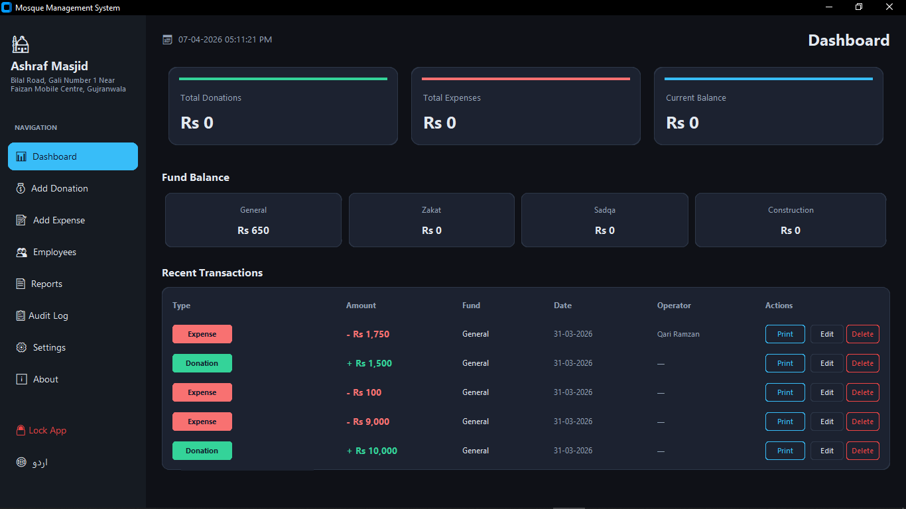
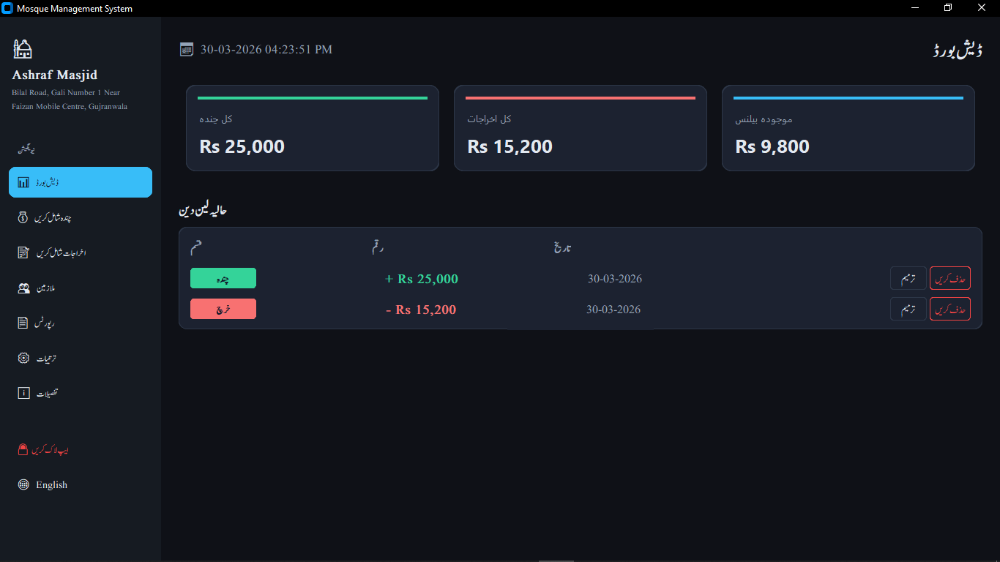
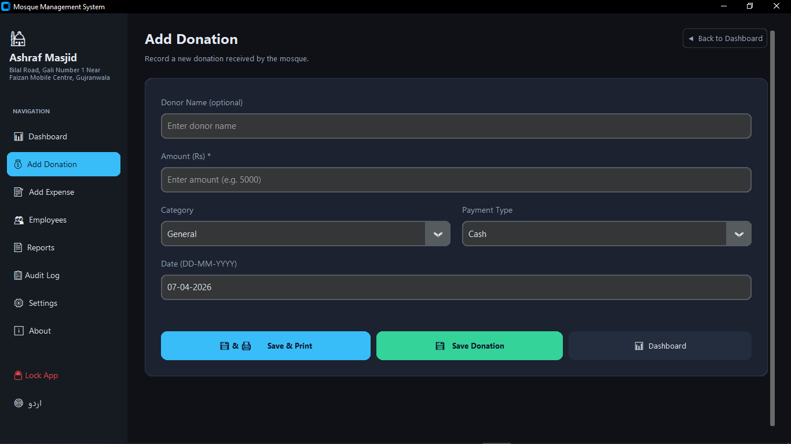
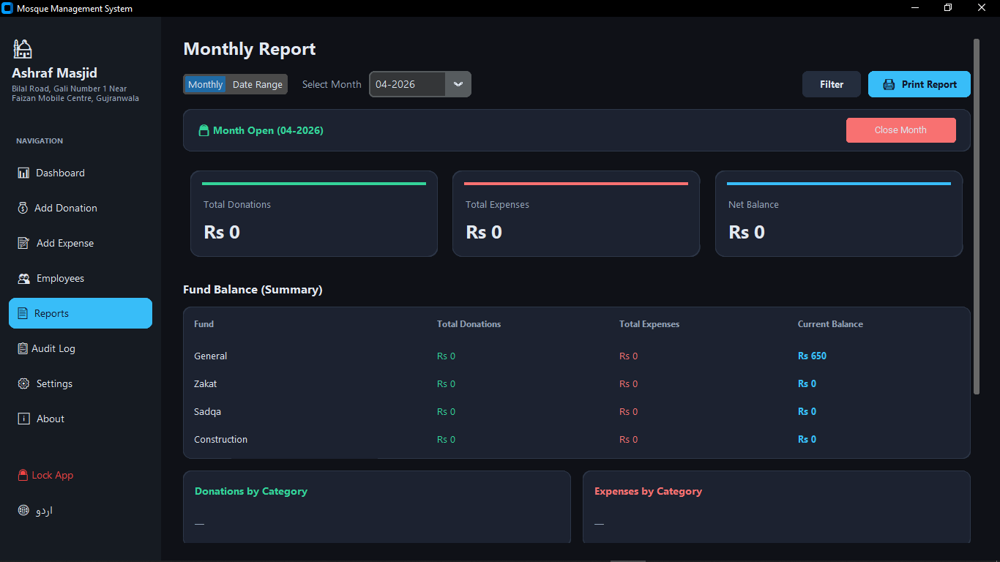
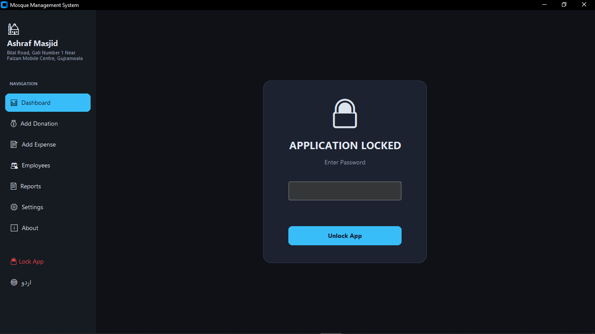

# 🕌 Mosque Management System (Finance Tracker)

[](https://www.python.org/downloads/)
[](https://github.com/salmanasmat/mosque-management)
[](https://www.gnu.org/licenses/gpl-3.0)
[](https://github.com/salmanasmat/mosque-management/releases)
[](https://github.com/salmanasmat/mosque-management)
[](https://github.com/salmanasmat/mosque-management/commits/)

A premium, offline-first desktop application designed for mosques to manage donations, expenses, and employee payroll with multi-language support (English & Urdu) and advanced security features.


## ✨ Features

- **💰 Donation Management**: Track General, Zakat, Sadqa, and Construction donations with strict purpose-based tracking.
- **📝 Expense Tracking**: Record electricity, gas, water, maintenance, and salary payouts with fund-specific controls.
- **📊 Interactive Dashboard**: Real-time summary of total donations, expenses, and net balance with visual breakdown.
- **📋 Full Audit Log**: Complete transparency with a detailed record of every administrative and financial action taken.
- **📄 Pro Reports**: Generate and print detailed financial reports including fund-based balance summaries.
- **👥 Human Resources**: Manage employees (Imams, Moazzins, etc.) and handle monthly salary disbursements efficiently.
- **🌐 Multi-Language Support**: Professional toggle between English and Urdu (Nastaleeq font) tailored for mosque use.
- **🔒 Advanced Security**:
  - **Startup Lock**: Instant password protection upon opening.
  - **Auto-Lock**: Session-based protection for inactivity.
  - **Password Management**: In-app secure credential updates.
- **💾 Data Maintenance**:
  - **Automated Backups**: One-click database backups with persistent default paths.
  - **Soft-Delete**: Safeguard against accidental data loss with soft-delete and timestamps.


## 🚀 Getting Started

### Prerequisites
- Python 3.8+
- [CustomTkinter](https://github.com/TomSchimansky/CustomTkinter)
- `sqlite3` (usually included with Python)

### Installation
1. Clone the repository:
   ```bash
   git clone https://github.com/salmanasmat/mosque-management.git
   cd mosque-management
   ```
2. Install dependencies:
   ```bash
   pip install customtkinter
   ```
3. Run the application:
   ```bash
   python mosque_app.py
   ```

## 📸 Screenshots

| Dashboard (English) | Dashboard (Urdu) |
| :---: | :---: |
|  |  |

| Add Donation | Monthly Report |
| :---: | :---: |
|  |  |

| Login Screen |
| :---: |
|  |

## 🛠️ Built With

- **Language**: Python
- **GUI Library**: [CustomTkinter](https://github.com/TomSchimansky/CustomTkinter) (Modern Dark Theme)
- **Database**: SQLite3
- **Fonts**: Segoe UI (English), Jameel Noori Nastaleeq (Urdu)

## 📄 License
This project is licensed under the GPL v3 License - see the [LICENSE](LICENSE) file for details.

---
Built with ❤️ for Mosque Management.
Salman Asmat
